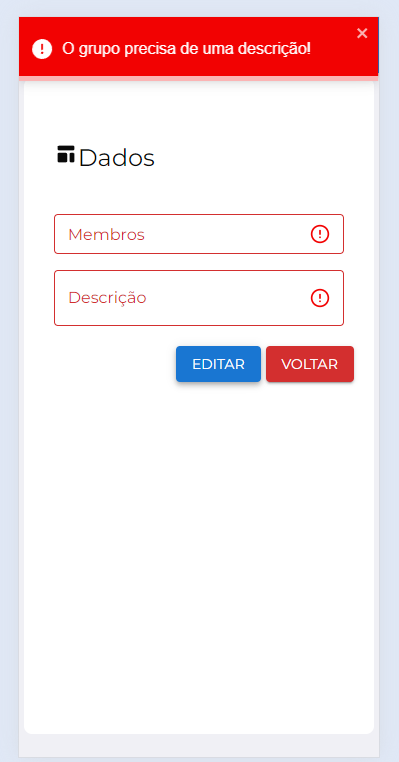

# Estuary Code Sample

## Internal Anonymous Assessment

### Components

#### Navbar

Thats the navbar that I used on Internal Anonymous Assessment project. Its projected to be responsive and it works the same way on desktop and on mobile versions. Clicking on Hamburguer Icon, a Drawer its opened on the left side giving access to the menu. Some components from Material UI lib were used there.

Navbar closed on desktop

Navbar opened on desktop

Navbar opened on mobile  

#### Tooltip

Thats the tooltip that shows the validation erros after sending a form. Its showed on the inputs and selects components of the application

Tooltip Closed  

Tooltip Opened

#### Select

Its a select that can be normal or it can have multiple items.   
You can select the options normally, or you can select a checkbox on the left of the item (by config).   
The items can be showed normally. Example "Item 1, Item 2, Item 3", or they can be shown with chips.   
It can have a max options limit to be selected.

#### Datatable

Its a Material UI datatable with some additional functionality.  
It can make you select the desired items with checkbox by configuration.  
It can have pagination by config.  
It can show all the data pre loaded and paginate it on the client side, but it also can make the request for backend, allowing a new request everytime the page is changed.  
It can have TableHead.  
It can display customizable actions for every row.  
It can have a dense button to make it more dense.  

It saves the dense and rows per page settings on the localStorage.

### Pages

#### Groups List

Thats the page that present the existent groups on a table component (The table component will be shown on the PointsForSpecialDietPeople components)

## Points For Special Diet People

### Components

#### CardProduct

Thats the card product component that represents each product on the dashboard of the application.

### Context

#### Auth

Its a context to make it possible to pass user data across the entire application. It can return the user data, a signIn function, a signOut function and a function to update user data.

#### Settings
  
Its a context to retrieve user's settings from the database. It can return the settings, a saveSettings function, a get settings from backend function and a save settings on the backend function.

### Pages

#### CreateProduct

Thats the page that allows the user to create a new product inside the application

#### ListProduct

This is the page that allows users to list their products in a table.

(It a simple page with list, the same way it was presented on the Datatable component)
